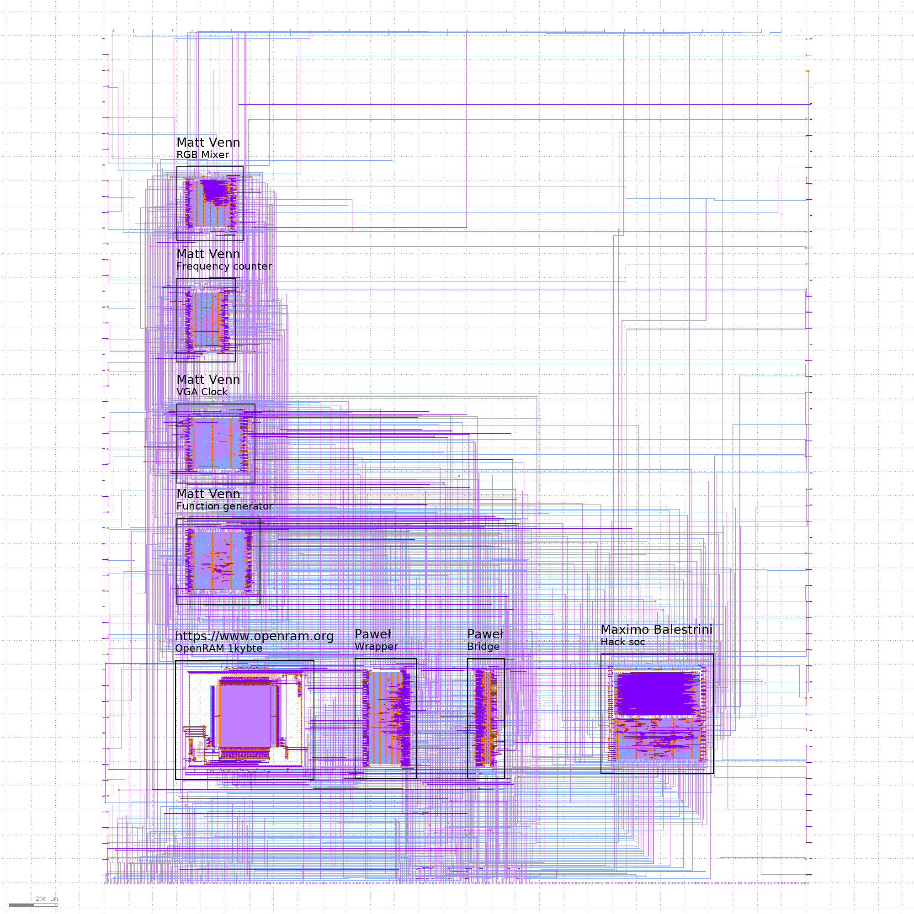
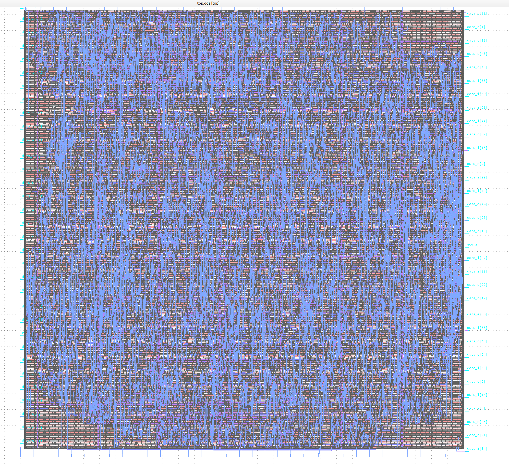

# Zero to ASIC Group submission MPW5

This ASIC was designed by members of the [Zero to ASIC course](https://zerotoasiccourse.com).

This submission was configured and built by the [multi project tools](https://github.com/mattvenn/multi_project_tools) at commit [e936b9cae8ef3f98a938902fd391758a5c1a6736](https://github.com/mattvenn/multi_project_tools/commit/e936b9cae8ef3f98a938902fd391758a5c1a6736).

    # clone all repos, and include support for shared OpenRAM
    ./multi_tool.py --clone-repos --clone-shared-repos --create-openlane-config --copy-gds --copy-project --openram

    # run all the tests
    ./multi_tool.py --test-all --force-delete

    # build user project wrapper submission
    cd $CARAVEL_ROOT; make user_project_wrapper

    # create docs
    ./multi_tool.py --generate-doc --annotate-image

# Project Index

## Function generator

* Author: Matt Venn
* Github: https://github.com/mattvenn/wrapped_function_generator
* commit: 9e73784d43a91d70cb1a7c9c5d42037f49ed9e67
* Description: arbitary function generator, using shared RAM as the output data

## VGA Clock

* Author: Matt Venn
* Github: https://github.com/mattvenn/wrapped_vga_clock
* commit: 6c7f12b8be62d34d4f4221e18b9408b3c5ac8fcd
* Description: shows the time on a 640x480 panel

## Frequency counter

* Author: Matt Venn
* Github: https://github.com/mattvenn/wrapped_frequency_counter
* commit: 94cd6e626492dc2f623bf06163e90a84bde553cb
* Description: Counts pulses on input and displays frequency on 2  seven segment displays

## RGB Mixer

* Author: Matt Venn
* Github: https://github.com/mattvenn/wrapped_rgb_mixer
* commit: 2676a8904591e92613fbfadf8c7f57fdfd79b1a4
* Description: reads 3 encoders and generates PWM signals to drive an RGB LED

## Hack soc

* Author: Maximo Balestrini
* Github: https://github.com/mbalestrini/wrapped_hack_soc
* commit: 54395c53d52f253bd71b35d0a1c2049c87d31103
* Description: Hardware implementation of the Hack Computer from the Nand to Tetris courses

## teras

* Author: Louis Ledoux AKA Binaryman
* Github: https://github.com/Bynaryman/wrapped_teras
* commit: 766588bd8519682347ea15680258cd97004fc377
* Description: matrix multiply unit with exact accumulators, no intermediate roundings, fused-dot-products, and posit arithmetic

