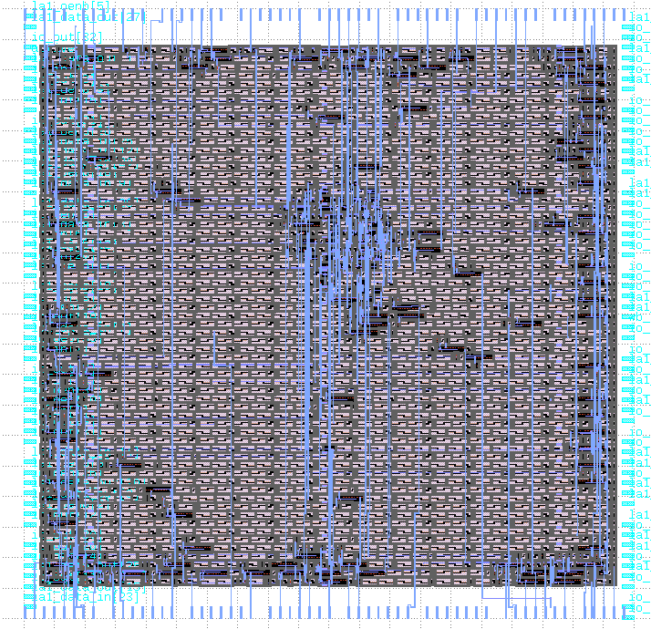
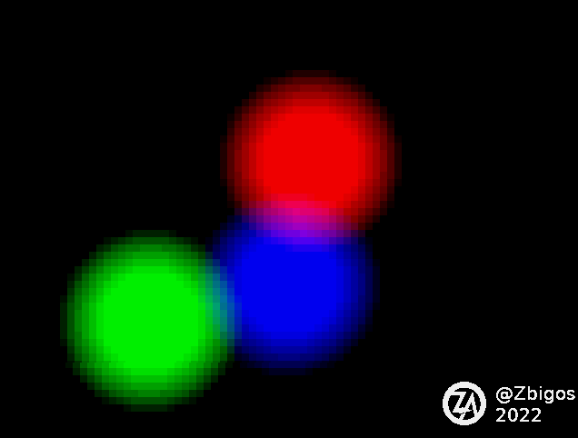
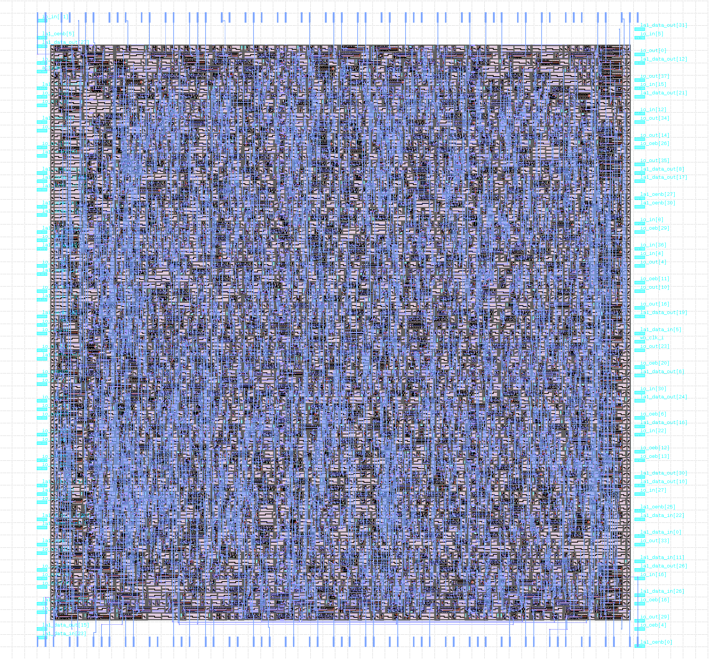

# Zero to ASIC Group submission MPW5

This ASIC was designed by members of the [Zero to ASIC course](https://zerotoasiccourse.com).

This submission was configured and built by the [multi project tools](https://github.com/mattvenn/multi_project_tools) at commit [e1cbd74a4186f8e9f8e0c244b65ed6b3acf64258](https://github.com/mattvenn/multi_project_tools/commit/e1cbd74a4186f8e9f8e0c244b65ed6b3acf64258).

    # clone all repos, and include support for shared OpenRAM
    ./multi_tool.py --clone-repos --clone-shared-repos --create-openlane-config --copy-gds --copy-project --openram

    # run all the tests
    ./multi_tool.py --test-all --force-delete

    # build user project wrapper submission
    cd $CARAVEL_ROOT; make user_project_wrapper

    # create docs
    ./multi_tool.py --generate-doc --annotate-image

# Project Index

## Function generator

* Author: Matt Venn
* Github: https://github.com/mattvenn/wrapped_function_generator
* commit: 9e73784d43a91d70cb1a7c9c5d42037f49ed9e67
* Description: arbitary function generator, using shared RAM as the output data

## VGA Clock

* Author: Matt Venn
* Github: https://github.com/mattvenn/wrapped_vga_clock
* commit: 6c7f12b8be62d34d4f4221e18b9408b3c5ac8fcd
* Description: shows the time on a 640x480 panel

## Frequency counter

* Author: Matt Venn
* Github: https://github.com/mattvenn/wrapped_frequency_counter
* commit: 94cd6e626492dc2f623bf06163e90a84bde553cb
* Description: Counts pulses on input and displays frequency on 2  seven segment displays

## RGB Mixer

* Author: Matt Venn
* Github: https://github.com/mattvenn/wrapped_rgb_mixer
* commit: 2676a8904591e92613fbfadf8c7f57fdfd79b1a4
* Description: reads 3 encoders and generates PWM signals to drive an RGB LED

## Hack soc

* Author: Maximo Balestrini
* Github: https://github.com/mbalestrini/wrapped_hack_soc
* commit: 54395c53d52f253bd71b35d0a1c2049c87d31103
* Description: Hardware implementation of the Hack Computer from the Nand to Tetris courses

## teras

* Author: Louis Ledoux AKA Binaryman
* Github: https://github.com/Bynaryman/wrapped_teras
* commit: c119cb48d76e8a4a62c80f98323efb114553c417
* Description: matrix multiply unit with exact accumulators, no intermediate roundings, fused-dot-products, and posit arithmetic

## ALU74181

* Author: Thorsten Knoll
* Github: https://github.com/ThorKn/wrapped_alu74181
* commit: 6e935d2d32acdcc66ab18c5894cb628b6c6b9048
* Description: Rebuild of the 4-bit Arithmetic Logic Unit 74181

## vga demo

* Author: Zbigniew Drozd
* Github: https://github.com/zbigos/wrapped-vgademo-on-fpga
* commit: 7fb9353f1a9f5120a0bd7907963a1c65919f33c0
* Description: quick demo displaying three floating blobs

## SiLife

* Author: Uri Shaked
* Github: https://github.com/wokwi/wrapped_silife
* commit: 53c45898bd6fc04530bf6e9d17153418db5dd175
* Description: Game of Life, in Silicon

## wrapped_acorn_prng

* Author: Zhenle Cao
* Github: https://github.com/ZhenleC/wrapped_acorn_prng
* commit: 5f7d3e5d0fcc9ffc3845dd7e97f55219ebd112ec
* Description: ACORN (Additive Congruential Random Number) generator, a pseudo random number generator made for the ZerotoASIC course to be taped out on SkyWater Open Source PDK SKY130 process. Design inspired from: http://acorn.wikramaratna.org/ . Huge shoutout and appreciation to Steven Goldsmith for his invaluable assistance with Caravel. 

## HSV Mixer

* Author: @proppy (forked from Matt Venn)
* Github: https://github.com/proppy/wrapped_hsv_mixer
* commit: 05ab3cfb40c1d934dceb3fe46740a491d4660f6f
* Description: reads HSV values from 3 encoders, convert to them RGB, and generates PWM signals to drive an RGB LED

## SkullFET

* Author: Uri Shaked
* Github: https://github.com/wokwi/wrapped_skullfet
* commit: 927e7275e6ba42f02fec99f5928941eeb985ee29
* Description: Barebone MOSFET transistors

